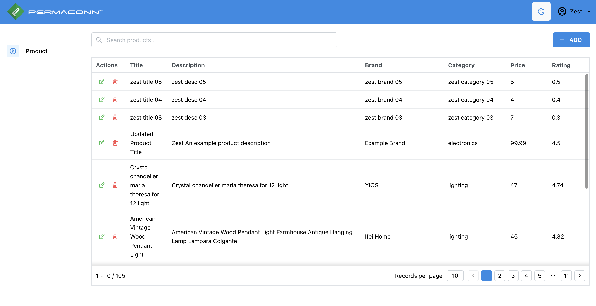
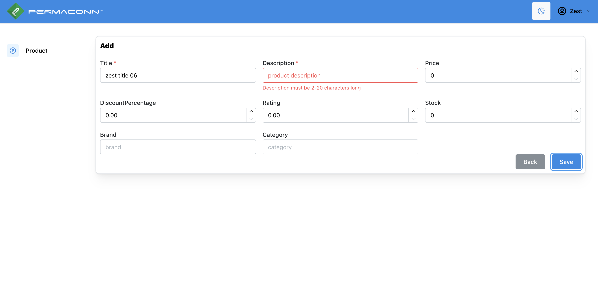

# Permanconn-frontend-zest

## npm scripts
- `npm install` – install dependencies

### Build and dev scripts

- `dev` – start dev server
- `build` – bundle application for production
- `export` – exports static website to `out` folder
- `analyze` – analyzes application bundle with [@next/bundle-analyzer](https://www.npmjs.com/package/@next/bundle-analyzer)

### Testing scripts

- `typecheck` – checks TypeScript types
- `lint` – runs ESLint
- `prettier:check` – checks files with Prettier
- `jest` – runs jest tests
- `jest:watch` – starts jest watch
- `test` – runs `jest`, `prettier:check`, `lint` and `typecheck` scripts

### Other scripts

- `storybook` – starts storybook dev server
- `storybook:build` – build production storybook bundle to `storybook-static`
- `prettier:write` – formats all files with Prettier

